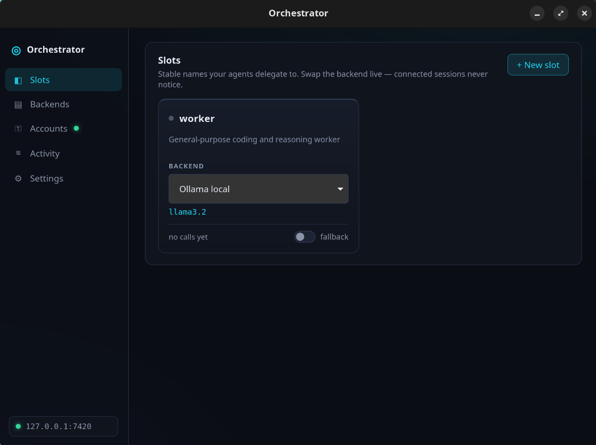

# Orchestrator

**Hot-swappable worker slots for any MCP client** (Claude Code, Codex CLI, and other).

Your main agent keeps one stable tool — `delegate` — while **you** decide which model/backend sits behind the `worker` (or `reviewer`, …) slot. Swap backends mid-session from a tray app **without** restarting MCP and **without** the main model needing to know the vendor.

```
Claude Code / Codex  --MCP HTTP-->  Orchestrator (tray)  --OpenAI/Anthropic-->  worker backends
                                         │
                                    slots.json (hot reload)
                                    Ollama · API keys · CLIProxyAPI subscriptions
```



## Features

- **MCP over streamable HTTP** on localhost (server outlives client sessions)
- **Two tools only:** `delegate` and `list_slots` (list never reveals vendor/model)
- **Call-time slot resolve** — edit config or GUI; next `delegate` uses the new backend
- **Conversation continuity** — history lives in Orchestrator, so threads survive slot swaps
- **Backends:** any OpenAI-compatible URL (Ollama, proxies, …) + native Anthropic — see [docs/BACKENDS.md](docs/BACKENDS.md) for recipes (z.ai coding plan, Ollama, API keys)
- **Agent onboarding:** copy-paste setup + usage prompt for any MCP client — [AGENT_SETUP.md](AGENT_SETUP.md)
- **Optional CLIProxyAPI sidecar** for subscription OAuth → local OpenAI-compatible API
- **Tray app** (Windows + Linux): slot board, accounts, Ollama discovery, usage log, manual update check

## Quick start (Windows)

### Installer (release)

1. Download the latest **NSIS** installer from [GitHub Releases](https://github.com/bencordeiro/orchestrator/releases).
2. Install and launch **Orchestrator** (tray icon appears; config + bearer token auto-created on first run).
3. Connect a backend:
   - **Ollama:** Local models → Discover → Create profile → assign to `worker`
   - **API key:** add a backend profile + store the key via the secrets/keychain flow
   - **Subscription:** Accounts → enable sidecar → OAuth (optional; see ToS risk below)
4. Copy the MCP setup command from the UI, or run:

```powershell
claude mcp add --transport http orchestrator http://localhost:7420/mcp `
  --header "Authorization: Bearer <token-from-app>"
```

5. In Claude Code: ask it to `delegate` a task.

### From source (dev)

```powershell
git clone https://github.com/bencordeiro/orchestrator.git
cd orchestrator
powershell -File scripts\download-cliproxy.ps1   # optional, for subscription sidecar
cd ui; npm install; cd ..
cargo test
# GUI:
cd ui; npm run tauri dev
# Headless MCP only:
cargo run -- serve
```

**One-command release build** (tests + UI + NSIS/MSI):

```powershell
powershell -ExecutionPolicy Bypass -File scripts\release.ps1
```

Installers land under `src-tauri\target\release\bundle\`.

## Quick start (Linux)

Packages: **`.deb`** (Debian/Ubuntu/Pop!_OS) and **`.AppImage`** (any distro).
Only the AppImage supports the in-app updater — Tauri cannot update a `.deb`.

```bash
sudo apt install ./Orchestrator_<version>_amd64.deb
# or
chmod +x Orchestrator_<version>_amd64.AppImage && ./Orchestrator_<version>_amd64.AppImage
```

Then connect a backend and copy the MCP setup command from **Settings →
Connect your agents**, exactly as on Windows.

> **Tray icon:** Orchestrator lives in the tray. GNOME needs the
> [AppIndicator extension](https://extensions.gnome.org/extension/615/appindicator-support/);
> on COSMIC enable the tray applet in panel settings. Without a tray host the
> app still runs and serves MCP — closing the window hides it, and relaunching
> brings it back.

### From source (dev)

Build prerequisites (Ubuntu/Debian/Pop!_OS — the Tauri v2 set, plus
`libdbus-1-dev` for the Secret Service keyring backend):

```bash
sudo apt update && sudo apt install -y \
  libwebkit2gtk-4.1-dev libssl-dev librsvg2-dev \
  libxdo-dev libayatana-appindicator3-dev libdbus-1-dev
curl --proto '=https' --tlsv1.2 -sSf https://sh.rustup.rs | sh
```

```bash
git clone https://github.com/bencordeiro/orchestrator.git
cd orchestrator
./scripts/download-cliproxy.sh    # optional, for subscription sidecar
(cd ui && npm ci)
cargo test
# GUI:
(cd ui && npm run tauri dev)
# Headless MCP only:
cargo run -- serve
```

**One-command release build** (tests + UI + deb/AppImage):

```bash
./scripts/release.sh
```

Packages land under `src-tauri/target/release/bundle/`.

## Slots & continuity

| Concept | Behavior |
|---------|----------|
| **Slot** | Stable name (`worker`, …) with a capability description |
| **Backend** | Swappable: model + base URL + auth ref (or subscription profile) |
| **Hot-swap** | GUI or `slots.json` edit → next `delegate` (no MCP restart) |
| **Fresh job** | Omit `conversation_id` |
| **Continued thread** | Pass prior `conversation_id`; history is replayed from disk |
| **Opacity** | `list_slots` never exposes vendor/model — only name + description |
| **Failures** | `worker unavailable: <reason>` — **no automatic** slot switching |
| **Fallback** | Optional chain, **off by default**, explicit opt-in in the GUI |

## Subscription ToS risk (read this)

Some backends can be wired through **subscription OAuth relays** (e.g. CLIProxyAPI). Providers have blocked or restricted third-party use of consumer subscriptions before.

Orchestrator does **not** hide this:

- Subscription lanes are **fragile and user-controlled**.
- Prefer **API keys** and **local models (Ollama)** when you need reliability or compliance.
- You are responsible for complying with each provider’s terms of service.

## Security (summary)

- Localhost MCP + bearer token  
- Secrets in OS keychain  
- See [SECURITY.md](SECURITY.md)

## Building & CI

| Script | Purpose |
|--------|---------|
| `scripts/download-cliproxy.ps1` | Download pinned CLIProxyAPI (checksummed), Windows x64 |
| `scripts/download-cliproxy.sh` | Download pinned CLIProxyAPI (checksummed), Linux/macOS |
| `scripts/release.ps1` | Full test + UI build + Tauri NSIS/MSI + optional `/health` smoke |
| `scripts/release.sh` | Full test + UI build + Tauri deb/AppImage + optional `/health` smoke |
| `.github/workflows/ci.yml` | Test on push (Windows + Linux matrix); release artifacts on tag |

The sidecar pin and per-platform checksums live in
`src-tauri/binaries/VERSION.txt`. Both download scripts read it, so adding a
target is a data change — append a `<platform>_url` / `_sha256` / `_binary` /
`_triple` group, no script edits.

**Future platforms:** macOS is not built yet (needs a Gatekeeper/signing
decision); the sidecar ships darwin builds upstream, so it is mostly packaging.

## License

MIT — see [LICENSE](LICENSE). Third-party notices: [THIRD-PARTY-NOTICES.md](THIRD-PARTY-NOTICES.md).

## Updater keys

Manual “Check for updates” only. Signing keys: [docs/UPDATER.md](docs/UPDATER.md).
